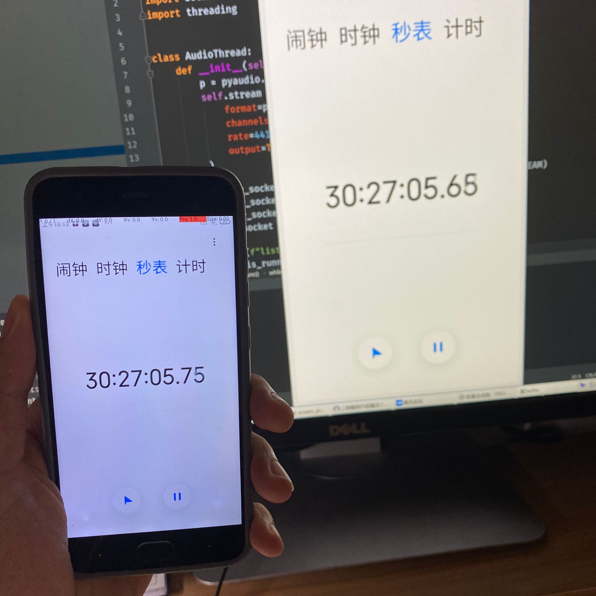
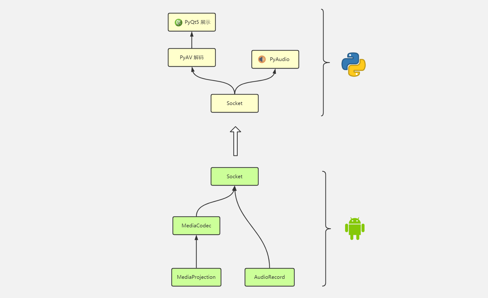

# sd01331110
大实验：安卓录屏推流

## 功能要求

1. 扫码连接 PC
3. 音频传输
4. 视频传输
5. 延迟保持在 100ms 以内

## 库

Python: PyAVC、PyAudio、PyQt5、qrcode
Android: zxing

## 样例

## 参考
- Android实现录屏直播（一）ScreenRecorder的简单分析：https://blog.csdn.net/zxccxzzxz/article/details/54150396
- 有关Android截图与录屏功能的学习：https://www.jianshu.com/p/d7eb518195fd
- ffmpeg解码H264裸流为YUV数据：https://longxuan.ren/2018/11/08/ffmpeg-H264-to-YUV/
- https://github.com/ChenTianSaber/ScreenRecorderShoter
- https://github.com/Yuandiaodiaodiao/PyScrcpy